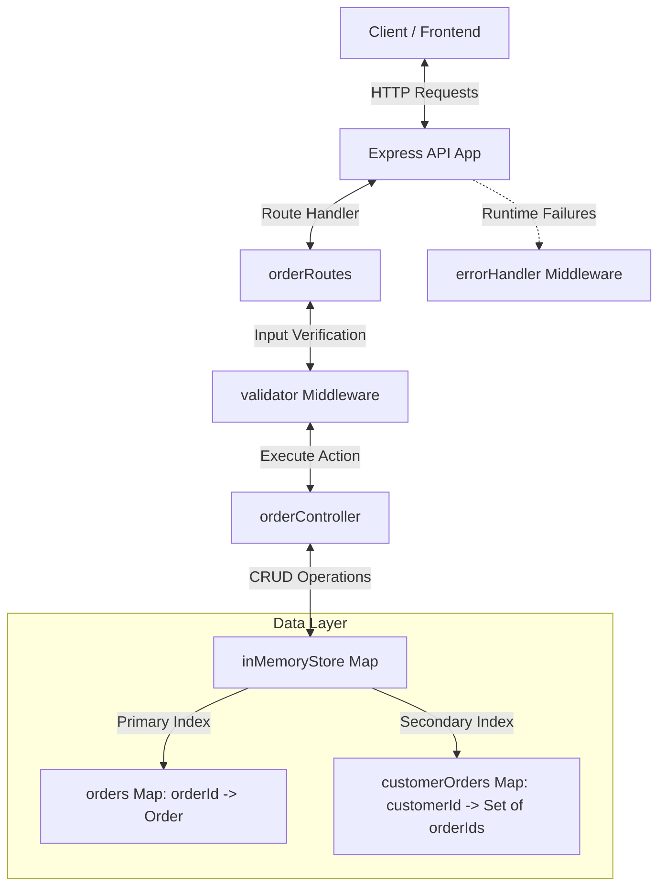

# High-Performance Order Tracking API 🚀

An ultra-fast, robust, and concurrent-ready REST API built using **Node.js** and **Express.js**. This API powers the order-tracking system of a high-volume e-commerce platform managing orders for customers in major cities like **Mumbai**, **Bengaluru**, and **Patna**.

---

## 🏗️ Architecture & High-Performance Design

To handle thousands of requests per minute under peak loads, the data access layer is designed to run in $O(1)$ constant time for primary operations:

1. **Primary Index (`Map`):** Orders are stored in a JavaScript `Map` where the key is the `orderId`. This allows retrieval and status updates of any order in $O(1)$ complexity.
2. **Secondary Index (`Map` of `Set`s):** To fetch orders by `customerId` efficiently, a secondary index maps each `customerId` to a `Set` of their `orderIds`. This avoids scanning the entire order collection, reducing lookup time to $O(K)$ where $K$ is the number of orders the specific customer has.

### System Architecture Flow



---

## 📂 Project Structure

The project follows a clean, modular design:

* [package.json](file:///C:/Users/uathe/Desktop/assignments/order-tracking-api/package.json) — Project configuration and dependencies.
* [src/server.js](file:///C:/Users/uathe/Desktop/assignments/order-tracking-api/src/server.js) — Entry server file that boots HTTP listener and manages graceful shutdowns.
* [src/app.js](file:///C:/Users/uathe/Desktop/assignments/order-tracking-api/src/app.js) — Express app configuration, global middlewares (JSON parsing, custom performance loggers, and CORS).
* [src/routes/orderRoutes.js](file:///C:/Users/uathe/Desktop/assignments/order-tracking-api/src/routes/orderRoutes.js) — Routes defining endpoints.
* [src/controllers/orderController.js](file:///C:/Users/uathe/Desktop/assignments/order-tracking-api/src/controllers/orderController.js) — Controller methods mapping HTTP requests to store operations.
* [src/store/inMemoryStore.js](file:///C:/Users/uathe/Desktop/assignments/order-tracking-api/src/store/inMemoryStore.js) — High-performance in-memory database with pre-populated seed data.
* [src/middleware/validator.js](file:///C:/Users/uathe/Desktop/assignments/order-tracking-api/src/middleware/validator.js) — Middleware confirming structure and integrity of client inputs (POST and PUT).
* [src/middleware/errorHandler.js](file:///C:/Users/uathe/Desktop/assignments/order-tracking-api/src/middleware/errorHandler.js) — Centralized middleware for unhandled exceptions and 404 Route Not Found responses.

---

## 🚀 Getting Started

### Prerequisites
Make sure you have [Node.js](https://nodejs.org/) installed (version 18+ recommended).

### Installation
1. Open your terminal in the `order-tracking-api` directory.
2. Install dependencies:
   ```bash
   npm install
   ```

### Running the API
* **Start Server in Production Mode:**
  ```bash
  npm start
  ```
* **Start Server in Development (Hot-Reload) Mode:**
  ```bash
  npm run dev
  ```

Once running, the server listens at **`http://localhost:3000`**.

---

## 📡 API Reference & Sample Requests

### 1. Root API Status
Returns metadata about the active server, running endpoints, and system time.
* **Endpoint:** `GET /`
* **Response (200 OK):**
  ```json
  {
    "success": true,
    "name": "High-Performance Order Tracking API",
    "version": "1.0.0",
    "description": "Ultra-fast order tracking system powered by Express and optimized ES6 in-memory stores.",
    "endpoints": {
      "createOrder": { "method": "POST", "path": "/orders", "body": "{ customerId, items, shippingAddress }" },
      "getOrderDetails": { "method": "GET", "path": "/orders/:id" },
      "updateOrderStatus": { "method": "PUT", "path": "/orders/:id/status", "body": "{ status }" },
      "getCustomerOrders": { "method": "GET", "path": "/customers/:customerId/orders" }
    },
    "systemTime": "2026-07-16T18:23:15.832Z"
  }
  ```

---

### 2. Create a New Order
Creates a new order in the store, calculates the total amount, and indexes the order under the customer's ID.
* **Endpoint:** `POST /orders`
* **Headers:** `Content-Type: application/json`
* **Request Body (Example: Patna Customer):**
  ```json
  {
    "customerId": "CUST-7703",
    "shippingAddress": {
      "city": "Patna",
      "state": "Bihar",
      "pincode": "800001",
      "street": "Fraser Road"
    },
    "items": [
      {
        "productId": "PROD-006",
        "name": "Smart Watch",
        "quantity": 1,
        "price": 8999.00
      }
    ]
  }
  ```
* **Response (201 Created):**
  ```json
  {
    "success": true,
    "message": "Order created successfully",
    "data": {
      "id": "ORD-1784226196060-1969",
      "customerId": "CUST-7703",
      "items": [
        {
          "productId": "PROD-006",
          "name": "Smart Watch",
          "quantity": 1,
          "price": 8999.00
        }
      ],
      "totalAmount": 8999.00,
      "status": "pending",
      "shippingAddress": {
        "city": "Patna",
        "state": "Bihar",
        "pincode": "800001",
        "street": "Fraser Road"
      },
      "createdAt": "2026-07-16T18:23:16.060Z",
      "updatedAt": "2026-07-16T18:23:16.060Z"
    }
  }
  ```

---

### 3. Fetch Order Details by Order ID
Retrieves details of a specific order in $O(1)$ time.
* **Endpoint:** `GET /orders/:id`
* **Request Example (Seed Order ORD-10001):**
  ```bash
  curl -X GET http://localhost:3000/orders/ORD-10001
  ```
* **Response (200 OK):**
  ```json
  {
    "success": true,
    "data": {
      "id": "ORD-10001",
      "customerId": "CUST-8821",
      "items": [
        { "productId": "PROD-001", "name": "Wireless Headphones", "quantity": 1, "price": 2999 },
        { "productId": "PROD-002", "name": "USB-C Cable", "quantity": 2, "price": 499 }
      ],
      "totalAmount": 3997,
      "status": "delivered",
      "shippingAddress": {
        "city": "Mumbai",
        "state": "Maharashtra",
        "pincode": "400001",
        "street": "Marine Drive"
      },
      "createdAt": "2026-07-16T10:30:00Z",
      "updatedAt": "2026-07-16T14:20:00Z"
    }
  }
  ```
* **Response (404 Not Found) if order does not exist:**
  ```json
  {
    "success": false,
    "message": "Order with ID ORD-99999 not found"
  }
  ```

---

### 4. Update the Status of an Order
Updates an order status. Allowed values: `pending`, `processing`, `shipped`, `delivered`, `cancelled`.
* **Endpoint:** `PUT /orders/:id/status`
* **Headers:** `Content-Type: application/json`
* **Request Body:**
  ```json
  {
    "status": "shipped"
  }
  ```
* **Response (200 OK):**
  ```json
  {
    "success": true,
    "message": "Order status updated to 'shipped' successfully",
    "data": {
      "id": "ORD-10003",
      "customerId": "CUST-4512",
      "items": [
        { "productId": "PROD-004", "name": "Mechanical Keyboard", "quantity": 1, "price": 4500 }
      ],
      "totalAmount": 4500,
      "status": "shipped",
      "shippingAddress": {
        "city": "Bengaluru",
        "state": "Karnataka",
        "pincode": "560001",
        "street": "Indiranagar"
      },
      "createdAt": "2026-07-16T21:00:00Z",
      "updatedAt": "2026-07-16T21:10:00Z"
    }
  }
  ```

---

### 5. List All Orders for a Specific Customer
Retrieves all orders placed by a specific customer using the indexed lookup.
* **Endpoint:** `GET /customers/:customerId/orders`
* **Request Example (Mumbai Customer CUST-8821):**
  ```bash
  curl -X GET http://localhost:3000/customers/CUST-8821/orders
  ```
* **Response (200 OK):**
  ```json
  {
    "success": true,
    "customerId": "CUST-8821",
    "count": 2,
    "data": [
      {
        "id": "ORD-10001",
        "customerId": "CUST-8821",
        "items": [...],
        "totalAmount": 3997,
        "status": "delivered",
        "shippingAddress": { "city": "Mumbai", "state": "Maharashtra", "pincode": "400001", "street": "Marine Drive" },
        "createdAt": "2026-07-16T10:30:00Z",
        "updatedAt": "2026-07-16T14:20:00Z"
      },
      {
        "id": "ORD-10002",
        "customerId": "CUST-8821",
        "items": [...],
        "totalAmount": 12500,
        "status": "shipped",
        "shippingAddress": { "city": "Mumbai", "state": "Maharashtra", "pincode": "400001", "street": "Marine Drive" },
        "createdAt": "2026-07-16T18:15:00Z",
        "updatedAt": "2026-07-16T19:00:00Z"
      }
    ]
  }
  ```

---

## 🛡️ Validation & Error Handling Examples

The API validates client input thoroughly to avoid corrupted state:

### Invalid POST Order Request Body
* **Request Body:**
  ```json
  {
    "customerId": "",
    "shippingAddress": {
      "city": ""
    },
    "items": []
  }
  ```
* **Response (400 Bad Request):**
  ```json
  {
    "success": false,
    "message": "Validation failed",
    "errors": [
      "customerId is required and must be a non-empty string",
      "shippingAddress.city is required and must be a non-empty string",
      "items is required and must be a non-empty array"
    ]
  }
  ```

### Invalid Status Update
* **Request Body:**
  ```json
  {
    "status": "delivered_soon"
  }
  ```
* **Response (400 Bad Request):**
  ```json
  {
    "success": false,
    "message": "Validation failed",
    "errors": [
      "status must be one of: pending, processing, shipped, delivered, cancelled"
    ]
  }
  ```
